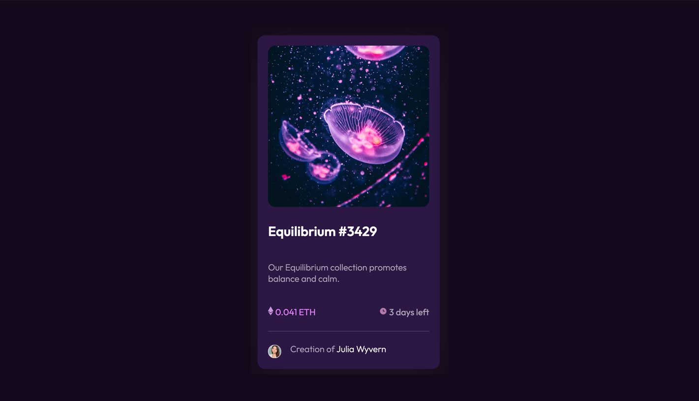
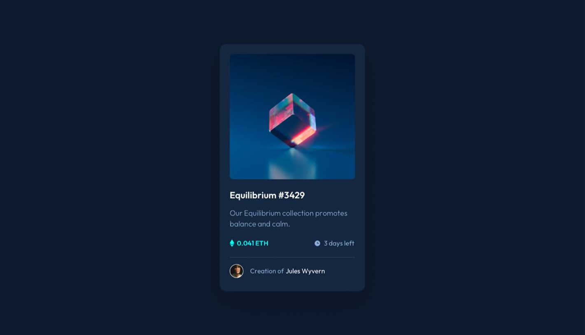

# NFT preview card component
This is my redesign to the challenge NFT preview card component from Frontend Mentor. 

 

## Overview

### Screenshot

#### ✧  _My Redesign_

#### ✦  Original (from Frontend Mentor)

### Links
- _My redesign:_ [_Click here to see it!_](https:/) 

- Original tutorial: [Frontend Mentor](https://www.frontendmentor.io/solutions/nft-preview-6rDBKlTQJ)

## My process

### Built with

- HTML5
- CSS3

### What I learned

I am new to CSS - and this tutorial helped me to figuring out how to change the svg color and reminding me not to forget about closing the tags :)

### Useful resources

- [Palete Picker](https://coolors.co) - This helped me with the color pallete thing. Amazing tool.
- [UI Gradients](https://uigradients.com) - Another amazing tool for generate beautiful color gradients. 
- [Hero Patterns](https://heropatterns.com) - Some beautiful patterns.
- [Vecteezy](https://www.vecteezy.com) - Free vectors.
- [Pexels free images](https://www.pexels.com/) - Good quality free photos!

## Author

- Website - [Lau Franco](https://onlycodesaves.wordpress.com/)
- Twitter I never use - [@only_code_saves](https://twitter.com/only_code_saves)
- Linkedin - [Ouch!](https://www.linkedin.com/in/laurianne-franco-de-lima/)

## Acknowledgments

Thanks for the Frontend Mentor for inspiration. 

Cristina Morillo and Leonid Danilov for the free photos on Pexels.

Stack Overflow [for teach me how to change the svg color.](
https://stackoverflow.com/questions/22252472/how-to-change-the-color-of-an-svg-element)

