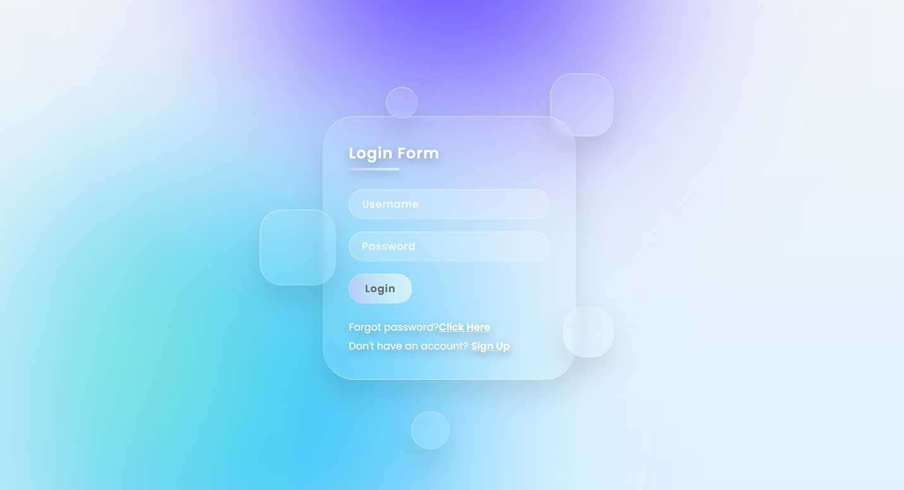
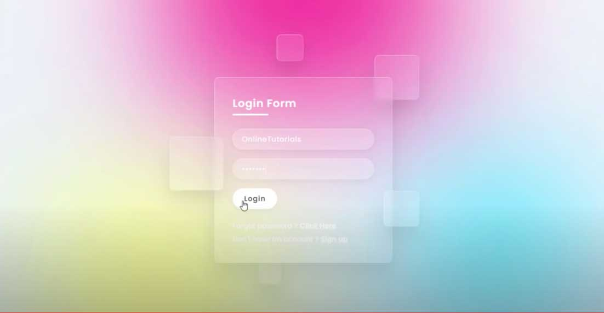

# Glassmorphism Login Form using Html & CSS 

This is my redesign to the tutorial Glassmorphism Login Form using Html & CSS from the Online Tutorial Youtube Channel. 

The original was beautiful, but I wanted to give it a more delicate and sophisticated touch in the details and color palette. 

I also added shadows on some items (Forgot passord and Sign Up) to improve readability in some browsers.

## Overview

### Screenshot

#### ✧  _My Redesign_

#### ✦  Original (from the Online Tutorial Youtube Channel)

### Links
- _My redesign, animated:_ [_Click here to see it moving!_](https://laufranco.github.io/CSS-Exercises/login-glass/index.html) 

- Original tutorial: [Online Tutorial Youtube Channel](https://www.youtube.com/watch?v=mW0Z1T8l7sU)

## My process

### Built with

- HTML5
- CSS3

### What I learned

I am new to CSS - and this tutorial helped me to better understand the placement of elements on the page, as well as working with animation, color and shape parameters.

### Useful resources

- [Palete Picker ](https://coolors.co) - This helped me with the color pallete thing. Amazing tool.
- [UI Gradients](https://uigradients.com) - Another amazing tool for generate beautiful color gradients. 

## Author

- Website - [Lau Franco](https://clojur.wordpress.com)
- Twitter - [@onlydatasaves](https://twitter.com/onlydatasaves)
- Linkedin - [Ouch!](https://twitter.com/onlydatasaves)

## Acknowledgments

Thanks for the Online Tutorial Youtube Channel for inspiration. The channel has severalI am new  CSS tutorials that are worth studying.