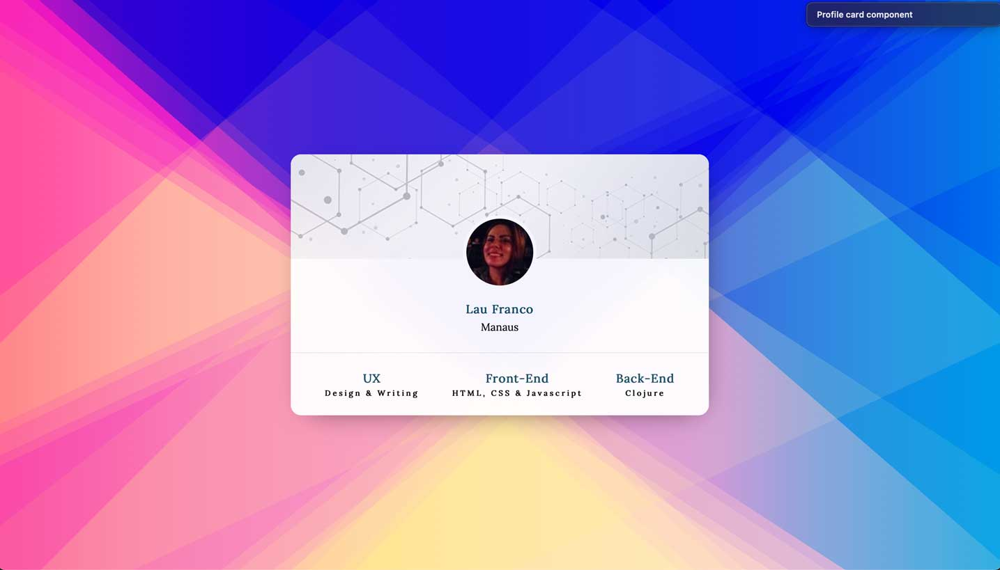

# Profile Card Component using Html & CSS 1 - Model 1

This is my redesign to the challenge Profile card component from Frontend Mentor. 

The original was beautiful, but I wanted to redesign it with. I think it got beautiful and striking. :) 

 

## Overview

### Screenshot

#### ✧  _My Redesign_

#### ✦  Original (from Frontend Mentor)

### Links
- _My redesign:_ [_Click here to see it!_](https:/) 

- Original tutorial: [Frontend Mentor](https://www.frontendmentor.io/challenges/profile-card-component-cfArpWshJ)

## My process

### Built with

- HTML5
- CSS3

### What I learned

I am new to CSS - and this tutorial helped me to better understand layers and positioning elements.

### Useful resources

- [Palete Picker](https://coolors.co) - This helped me with the color pallete thing. Amazing tool.
- [UI Gradients](https://uigradients.com) - Another amazing tool for generate beautiful color gradients. 
- [Hero Patterns](https://heropatterns.com) - Some beautiful patterns.
- [Vecteezy](https://www.vecteezy.com) - Free vectors.

## Author

- Website - [Lau Franco](https://clojur.wordpress.com)
- Twitter - [@onlydatasaves](https://twitter.com/onlydatasaves)
- Linkedin - [Ouch!](https://twitter.com/onlydatasaves)

## Acknowledgments

Thanks for the Frontend Mentor for inspiration. 