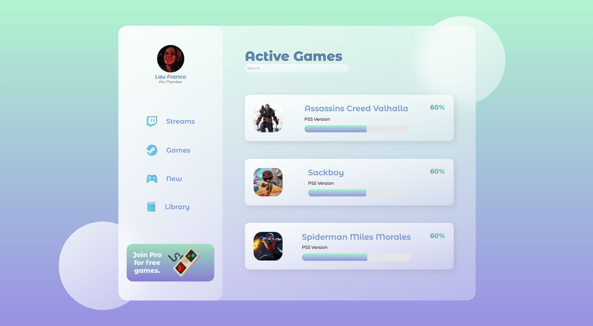
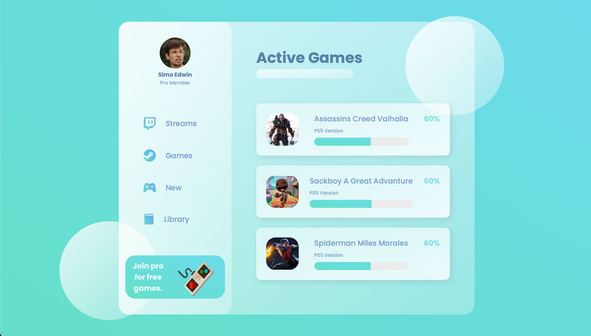

# Glass Website with HTML and CSS Tutorial
This is my redesign to the Glass Website with HTML and CSS Tutorial from Dev Ed Youtube Channel. 

 

## Overview

### Screenshot

#### ✧  _My Redesign_

#### ✦  Original (Dev Ed Youtube Channel)

### Links
- _My redesign:_ [_Click here to see it!_](https:/) 

- Original tutorial: [Dev Ed Youtube Channel](https://www.youtube.com/watch?v=O7WbVj5apxU&t=262s)

 

## My process

### Built with

- HTML5
- CSS3

### What I learned

I am new to CSS - and this tutorial helped me internalize the "div" thing :)

### Useful resources

- [Palete Picker](https://coolors.co) - Color pallete thing. Amazing tool.
- [UI Gradients](https://uigradients.com) - Amazing tool for generate beautiful color gradients. 
- [Web Gradients](https://webgradients.com/) - Amazing tool for generate beautiful color gradients 2. 
- [Hero Patterns](https://heropatterns.com) - Some beautiful patterns.
- [Vecteezy](https://www.vecteezy.com) - Free vectors.
- [Pexels free images](https://www.pexels.com/) - Good quality free photos!

## Author

- Website - [Lau Franco](https://clojur.wordpress.com)
- Twitter - [@onlydatasaves](https://twitter.com/onlydatasaves)
- Linkedin - [Ouch!](https://www.linkedin.com/in/laurianne-franco/)

## Acknowledgments

Thanks for Dev Ed Youtube Channel for inspiration. 

All the Stack Overflow contibuitors, [as always.](
https://stackoverflow.com)

